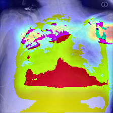
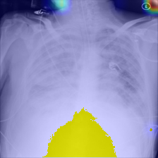
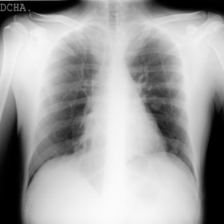
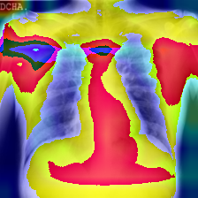
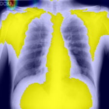
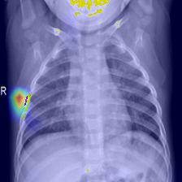
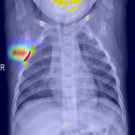

# Medical-XAI-Lab

## Explainable AI for Chest X-ray Classification

Medical-XAI-Lab is a deep learning research project focused on
interpretable chest X-ray image classification using Explainable Artificial
Intelligence (XAI) techniques.

The project develops an end-to-end AI pipeline that combines:

* Chest X-ray image classification
* Model evaluation
* Explainable AI visualization
* Transparent analysis of model decisions

The main objective is not only to achieve accurate classification but also
to understand which image regions contribute to the model prediction.

---

# Project Objective

The goal of this project is to develop an interpretable deep learning system
for three-class chest X-ray classification:

* COVID-19
* Lung Opacity
* Normal

The project investigates how Explainable AI methods can improve transparency
and trustworthiness of deep learning models in medical imaging applications.

---

# Dataset

The dataset consists of chest X-ray images divided into three balanced classes:

| Class        | Training | Validation |
| ------------ | -------: | ---------: |
| COVID-19     |      800 |        200 |
| Lung Opacity |      800 |        200 |
| Normal       |      800 |        200 |

Total dataset:

* Training images: 2400
* Validation images: 600

All classes are balanced to provide fair model evaluation.

Dataset validation is automatically checked using:

```
training/dataset_summary.py
```

---

# Model

The baseline classification model is a VGG16-based convolutional neural
network developed for three-class chest X-ray classification.

## Model Information

Architecture:

* VGG16-based CNN
* Input size: 224 × 224 pixels
* Classification task: 3 classes

Classes:

* COVID-19
* Lung Opacity
* Normal

Model file:

```
models/vgg16_3class-3000-V-1.keras
```

---

# Data Processing Pipeline

The implemented workflow:

```
Chest X-ray Dataset
          |
          v
     Data Loader
          |
          v
   VGG16-based CNN
          |
          v
    Prediction
          |
          v
    Evaluation
          |
          v
 Explainable AI Analysis
```

---

# Explainable AI Methods

To improve model transparency, two XAI techniques were implemented.

---

## 1. Grad-CAM

Gradient-weighted Class Activation Mapping (Grad-CAM) was used to visualize
the image regions that contributed to CNN predictions.

Grad-CAM analysis:

```
docs/gradcam_analysis.md
```

Output examples:

```
outputs/GradCAM/
```

---

## 2. Score-CAM

Score-CAM was implemented as a gradient-free explanation method based on
activation map importance and prediction confidence.

Score-CAM analysis:

```
docs/scorecam_analysis.md
```

Output examples:

```
outputs/ScoreCAM/
```

---

# Evaluation Results

The model was evaluated on the balanced validation dataset containing
600 chest X-ray images.

## Overall Performance

| Metric    |  Score |
| --------- | -----: |
| Accuracy  | 93.00% |
| Precision | 93.52% |
| Recall    | 93.00% |
| F1-score  | 93.02% |

## Class-wise Performance

| Class        | Precision | Recall | F1-score |
| ------------ | --------: | -----: | -------: |
| COVID-19     |      0.85 |   0.96 |     0.90 |
| Lung Opacity |      0.96 |   0.85 |     0.90 |
| Normal       |      0.99 |   0.97 |     0.98 |

Detailed evaluation outputs:

```
outputs/Evaluation/

├── confusion_matrix.png
├── metrics.json
└── classification_report.txt
```

---

# Confusion Matrix

The confusion matrix provides detailed information about prediction behavior
between the three classes.

Output:

```
outputs/Evaluation/confusion_matrix.png
```

---

# Explainable AI Visualization Examples

## Lung Opacity Example

Original X-ray:


Grad-CAM:



Score-CAM:



---

## COVID Example

Original X-ray:



Grad-CAM:



Score-CAM:



---

## Normal Example

Original X-ray:


Grad-CAM:



Score-CAM:



---

# Project Structure

```
Medical-XAI-Lab/

├── models/
│   └── vgg16_3class-3000-V-1.keras
│
├── training/
│   ├── data_loader.py
│   ├── test_data_loader.py
│   └── dataset_summary.py
│
├── evaluation/
│   ├── metrics.py
│   ├── confusion_matrix.py
│   └── evaluate_model.py
│
├── outputs/
│   ├── GradCAM/
│   ├── ScoreCAM/
│   └── Evaluation/
│       ├── confusion_matrix.png
│       ├── metrics.json
│       └── classification_report.txt
│
├── docs/
│   ├── gradcam_analysis.md
│   └── scorecam_analysis.md
│
├── gradcam.py
├── scorecam.py
├── run_gradcam.py
├── run_scorecam.py
├── config.py
└── README.md
```

---

# Technologies

* Python
* TensorFlow / Keras
* OpenCV
* NumPy
* Scikit-learn
* Deep Learning
* Computer Vision
* Explainable AI

---

# Future Work

Planned improvements:

* ResNet50 Transfer Learning
* Vision Transformer (ViT)
* Swin Transformer architectures
* Medical image segmentation
* Uncertainty estimation
* Advanced XAI evaluation methods
* Model comparison and benchmarking

---

# Author

Medical AI Research Project
