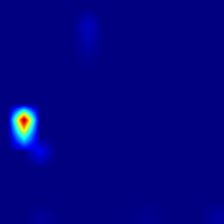
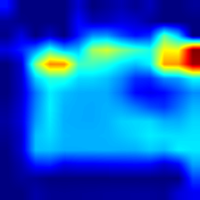
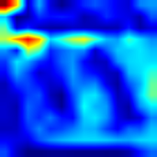

# Grad-CAM Explainability Analysis

## Project

Medical-XAI-Lab

## Model

VGG16 Transfer Learning

## Task

Three-class Chest X-ray Classification

Classes:

- Normal
- COVID
- Lung Opacity

---

# Prediction Results

| Image | Prediction | Confidence |
|---|---|---|
| Normal-1000.png | Normal | 100% |
| COVID-1000.png | COVID | 96.46% |
| Lung_Opacity-1000.png | Lung_Opacity | 96.92% |

---

# Explainability Method

Grad-CAM was applied to visualize the image regions contributing to the model decisions.

---

# Observations

## Normal

The model produced a confident prediction.

Grad-CAM showed limited activation, suggesting the absence of strong pathological patterns.

A small activation outside the lung region was observed, which may indicate sensitivity to image artifacts or markers.

## COVID

The model attention was mainly located in thoracic regions.

The activation pattern was distributed across bilateral lung areas.

Further analysis is required to verify correspondence with pathological findings.

## Lung Opacity

The model showed stronger concentrated activation patterns.

Highlighted regions were mainly located in central and lower thoracic areas.

These regions may correspond to opacity-related features.

---

# Conclusion

Grad-CAM provides an initial interpretation of model decisions.

Although classification confidence is high, further XAI methods such as Score-CAM and attention-based visualization are required for improved reliability.

## Sample 1: Normal Chest X-ray

Image:
Normal-1000.png

True Class:
Normal

Prediction:
Normal

Confidence:
100%

Grad-CAM Visualization:

## Sample 2: Lung_Opacity Chest X-ray

Image:
Lung_Opacity-1000.png

True Class:
Lung_Opacity

Prediction:
Lung_Opacity

Confidence:
96.92%

Grad-CAM Visualization:

## Sample 3: COVID Chest X-ray

Image:
COVID-1000.png

True Class:
COVID

Prediction:
COVID

Confidence:
96.46%

Grad-CAM Visualization:

