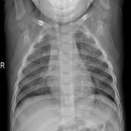
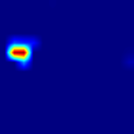
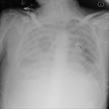

# Score-CAM Analysis

## 1. Introduction

Explainable Artificial Intelligence (XAI) techniques are essential for understanding
the decision-making process of deep learning models in medical image analysis.

In this project, Score-CAM (Score-Weighted Class Activation Mapping) was applied
to visualize the important regions of chest X-ray images that contributed to the
model prediction.

---

## 2. Methodology

Score-CAM is a gradient-free visualization method.

The process includes:

1. Extracting feature maps from the convolutional layer.
2. Generating activation-based masks.
3. Applying masks to the input image.
4. Measuring prediction confidence changes.
5. Using confidence scores as weights.
6. Generating the final heatmap.

---

## 3. Experimental Results

### Sample 1: Normal Chest X-ray

Image:
Normal-1000.png

True Class:
Normal

Prediction:
Normal

Confidence:
100%

Grad-CAM Visualization:

### Sample 2: Lung_Opacity Chest X-ray

Image:
Lung_Opacity-1000.png

True Class:
Lung_Opacity

Prediction:
Lung_Opacity

Confidence:
96.92%

Grad-CAM Visualization:

### Sample 3: COVID Chest X-ray

Image:
COVID-1000.png

True Class:
COVID

Prediction:
COVID

Confidence:
96.45%

Grad-CAM Visualization:

---

## 4. Interpretation

The Score-CAM heatmap shows that the model focused on clinically relevant
regions of the lung field instead of irrelevant background areas.

This improves confidence that the deep learning model is learning meaningful
radiological features.

---

## 5. Comparison with Grad-CAM

| Method | Type | Main Advantage |
|---|---|---|
| Grad-CAM | Gradient-based | Fast and widely adopted |
| Score-CAM | Score-based | More stable and gradient-free |

Both approaches provide complementary explanations for model predictions.

---

## 6. Conclusion

Score-CAM improves the transparency of the classification model and demonstrates
the potential of Explainable AI techniques for trustworthy medical imaging systems.

